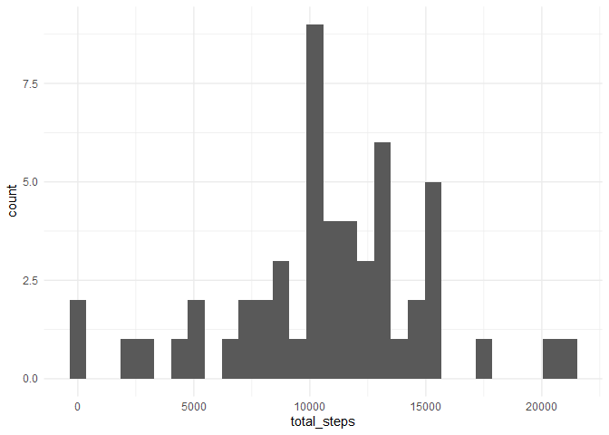
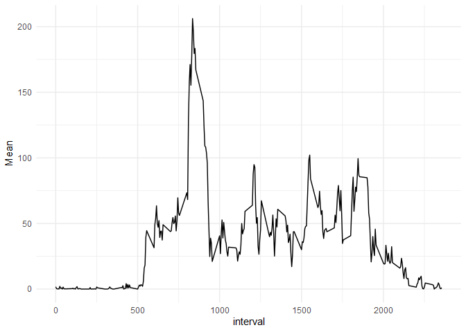
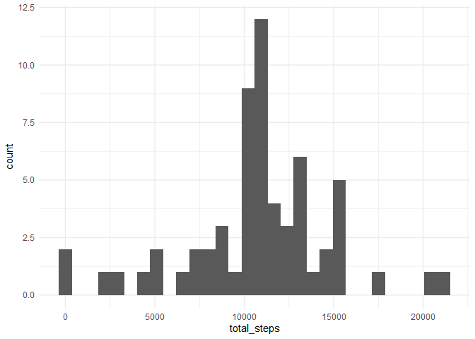
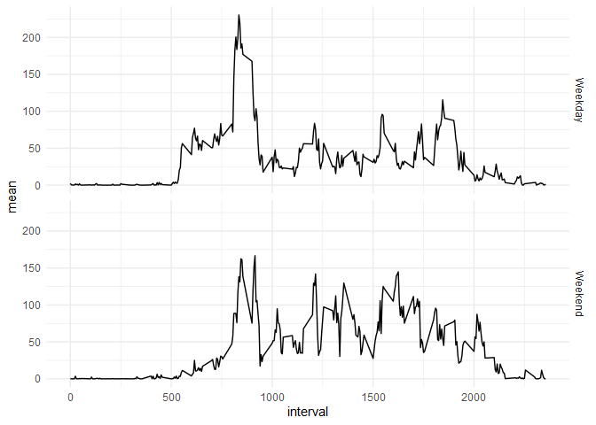

## Loading and preprocessing the data


```r
library(tidyverse)
```

```
## -- Attaching packages --------------------------------------- tidyverse 1.3.1 --
```

```
## v ggplot2 3.3.3     v purrr   0.3.4
## v tibble  3.1.0     v dplyr   1.0.6
## v tidyr   1.1.3     v stringr 1.4.0
## v readr   1.4.0     v forcats 0.5.1
```

```
## -- Conflicts ------------------------------------------ tidyverse_conflicts() --
## x dplyr::filter() masks stats::filter()
## x dplyr::lag()    masks stats::lag()
```

```r
library(lubridate)
```

```
## 
## Attaching package: 'lubridate'
```

```
## The following objects are masked from 'package:base':
## 
##     date, intersect, setdiff, union
```

```r
library(knitr)

theme_set(theme_minimal()) #Change the setup for ggplot graphics.

knitr::opts_chunk$set(echo = TRUE,
                      dev.args = list(png = list(type = "cairo")))
```


```r
unzip("C:/Users/bsmor/OneDrive/Dokumenter/Reproducible_research/RepData_PeerAssessment1-master/activity.zip") 

dt <- read_csv("activity.csv")
```

```
## 
## -- Column specification --------------------------------------------------------
## cols(
##   steps = col_double(),
##   date = col_date(format = ""),
##   interval = col_double()
## )
```


## What is mean total number of steps taken per day?


```r
dt %>% 
  group_by(date) %>% 
  summarise("Total steps" = sum(steps))
```

```
## # A tibble: 61 x 2
##    date       `Total steps`
##    <date>             <dbl>
##  1 2012-10-01            NA
##  2 2012-10-02           126
##  3 2012-10-03         11352
##  4 2012-10-04         12116
##  5 2012-10-05         13294
##  6 2012-10-06         15420
##  7 2012-10-07         11015
##  8 2012-10-08            NA
##  9 2012-10-09         12811
## 10 2012-10-10          9900
## # ... with 51 more rows
```

### histogram of the total amount of steps.


```r
dt %>% 
  group_by(date) %>% 
  summarise("total_steps"= sum(steps)) %>% 
  ggplot(aes(total_steps)) +
  geom_histogram()
```

```
## `stat_bin()` using `bins = 30`. Pick better value with `binwidth`.
```

```
## Warning: Removed 8 rows containing non-finite values (stat_bin).
```

<!-- -->


In order to calculate the mean and median, we have to remove the missing values.


```r
dt %>% 
  group_by(date) %>% 
  summarise("total_steps" = sum(steps)) %>% 
  na.omit() %>% 
  summarise(mean(total_steps), median(total_steps))
```

```
## # A tibble: 1 x 2
##   `mean(total_steps)` `median(total_steps)`
##                 <dbl>                 <dbl>
## 1              10766.                 10765
```


## What is the average daily activity pattern?

A line diagram showing the mean of the intervals.

```r
dt %>% 
  group_by(interval) %>% 
  na.omit() %>% 
  summarise(Mean = mean(steps)) %>% 
  ggplot(aes(interval, Mean)) +
  geom_line()
```

<!-- -->


Interval 835 has the highest mean.

```r
dt %>% 
  group_by(interval) %>% 
  na.omit() %>% 
  summarise(mean = mean(steps)) %>%
  filter(mean == max(mean))
```

```
## # A tibble: 1 x 2
##   interval  mean
##      <dbl> <dbl>
## 1      835  206.
```


## Imputing missing values


There are 2304 missing values.


```r
sum(is.na(dt))
```

```
## [1] 2304
```


Here we replace the missing values with mean based on which interval the missing value is in. Futhermore we load the new data into the frame "no_na_dt".


```r
no_na_dt <- dt %>% 
  group_by(interval) %>% 
  mutate(steps = replace_na(steps, mean(steps, na.rm = TRUE))) %>% 
  ungroup()
```


Histogram of the total number of steps taken each day


```r
no_na_dt %>% 
  group_by(date) %>% 
  summarise(total_steps = sum(steps)) %>% 
  ggplot(aes(total_steps)) +
  geom_histogram()
```

```
## `stat_bin()` using `bins = 30`. Pick better value with `binwidth`.
```

<!-- -->

The mean and median total number of steps taken per day. The values are close to the original values, but there is a difference. 


```r
no_na_dt %>% 
  group_by(date) %>% 
  summarise(total_steps = sum(steps)) %>% 
  summarise(mean(total_steps), median(total_steps))
```

```
## # A tibble: 1 x 2
##   `mean(total_steps)` `median(total_steps)`
##                 <dbl>                 <dbl>
## 1              10766.                10766.
```


## Are there differences in activity patterns between weekdays and weekends?

Yes, there are more steps in the earlier intervals in the weekdays. However across all intervals the weekend has more steps.


```r
no_na_dt %>% 
  mutate(weekday = wday(date, label =F),
         weekday = case_when(weekday >= 2 & weekday <= 6 ~ 1,
                             weekday == 1 | weekday == 7 ~ 2),
         weekday = factor(weekday, levels = c(1:2), labels = c("Weekday", "Weekend"))) %>%
  group_by(weekday, interval) %>% 
  summarise(mean = mean(steps)) %>% 
  ggplot(aes(interval, mean)) +
  geom_line() +
  facet_grid(row = vars(weekday))
```

```
## `summarise()` has grouped output by 'weekday'. You can override using the `.groups` argument.
```

<!-- -->


